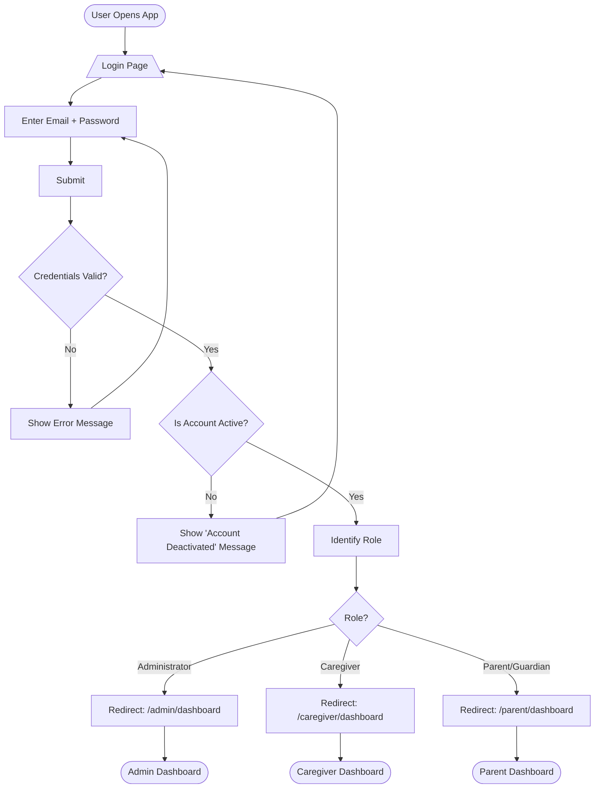
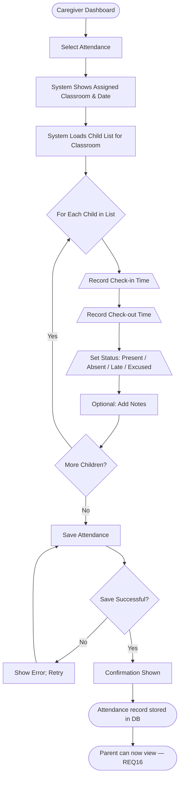
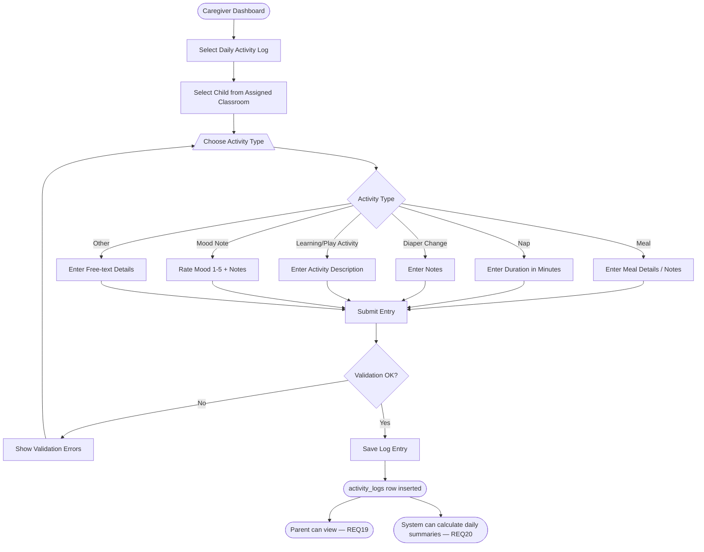
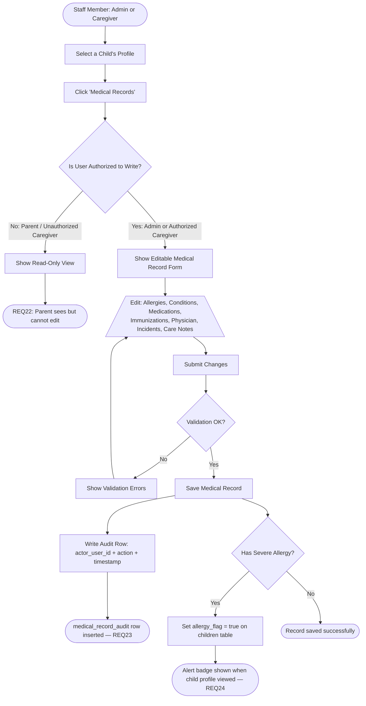
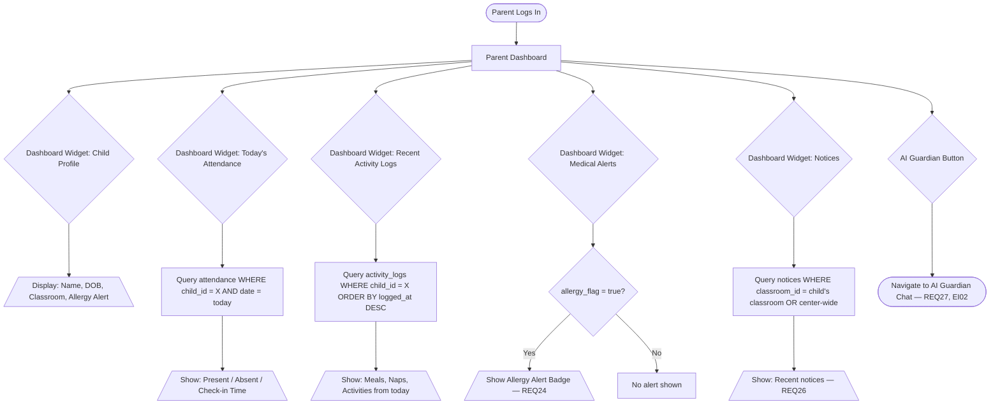
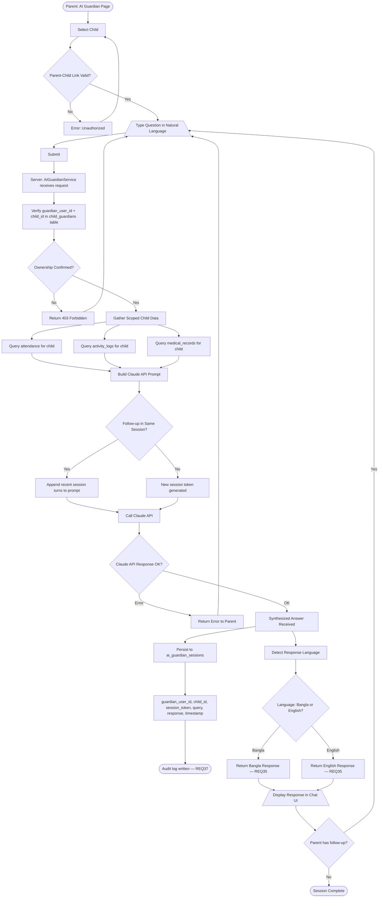
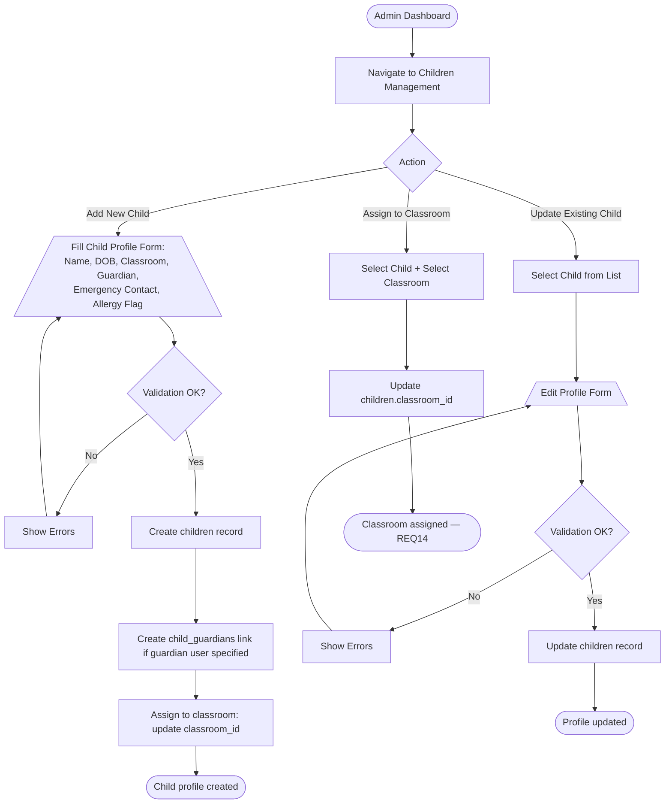
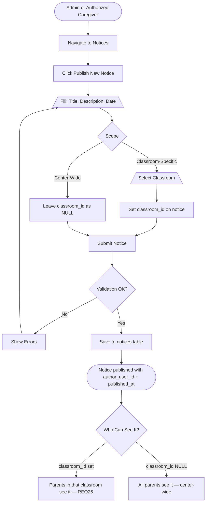
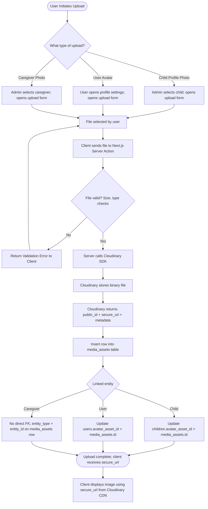
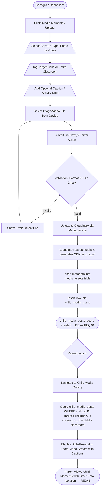

# KiddieOps — System Flowcharts

**Version:** 1.0 (Week 2 — Design & Planning)  
**Source of Truth:** `KiddieOps_SRS.docx`

> All flowcharts in this document are documentation artifacts only. They describe planned system behavior to guide implementation in Week 3+.

---

## Table of Contents

1. [FC-01: User Login & Role-Based Routing](#fc-01-user-login--role-based-routing)
2. [FC-02: Caregiver Takes Attendance](#fc-02-caregiver-takes-attendance)
3. [FC-03: Caregiver Logs a Daily Activity](#fc-03-caregiver-logs-a-daily-activity)
4. [FC-04: Authorized Staff Records / Updates a Medical Record](#fc-04-authorized-staff-records--updates-a-medical-record)
5. [FC-05: Parent Views Their Child's Information](#fc-05-parent-views-their-childs-information)
6. [FC-06: AI Guardian Query Flow](#fc-06-ai-guardian-query-flow)
7. [FC-07: Administrator Manages a Child Profile](#fc-07-administrator-manages-a-child-profile)
8. [FC-08: Notice Publishing Flow](#fc-08-notice-publishing-flow)
9. [FC-09: File / Image Upload via Cloudinary](#fc-09-file--image-upload-via-cloudinary)
10. [FC-10: Parent Submits Complaint with Proof & Admin Resolution](#fc-10-parent-submits-complaint-with-proof--admin-resolution)
11. [FC-11: Caregiver Child Photo/Video Upload & Parent Media Gallery](#fc-11-caregiver-child-photovideo-upload--parent-media-gallery)

---

## FC-01: User Login & Role-Based Routing

**Implements:** REQ01, REQ02, REQ03  
**Use Case:** UC-01



---

## FC-02: Caregiver Takes Attendance

**Implements:** REQ15, REQ16, REQ17  
**Use Case:** UC-02



---

## FC-03: Caregiver Logs a Daily Activity

**Implements:** REQ18, REQ19, REQ20  
**Use Case:** UC-03



---

## FC-04: Authorized Staff Records / Updates a Medical Record

**Implements:** REQ21, REQ22, REQ23, REQ24  
**Use Case:** UC-04



---

## FC-05: Parent Views Their Child's Information

**Implements:** REQ10, REQ16, REQ19, REQ22, REQ26, REQ27



---

## FC-06: AI Guardian Query Flow

**Implements:** REQ30, REQ31, REQ32, REQ33, REQ35, REQ36, REQ37  
**Use Case:** UC-05



---

## FC-07: Administrator Manages a Child Profile

**Implements:** REQ08, REQ09, REQ10, REQ14



---

## FC-08: Notice Publishing Flow

**Implements:** REQ25, REQ26



---

## FC-09: File / Image Upload via Cloudinary

**Implements:** Cloudinary integration (Week 2 architecture decision)



---

## FC-10: Parent Submits Complaint with Proof & Admin Resolution

**Implements:** REQ38, REQ39  
**Use Case:** UC-06

```mermaid
flowchart TD
    A([Parent Dashboard]) --> B[Click 'Complaints / Incident Report']
    B --> C[/Open Complaint Filing Form\]
    C --> D[/Select Target Caregiver\]
    C --> E[/Select Affected Child (Optional)\]
    C --> F[/Enter Title & Incident Description\]
    C --> G[/Optional: Attach Photo / Document Proof\]

    G --> H{Has Proof Attachment?}
    H -- Yes --> I[Upload File to Cloudinary SDK via Server Action]
    I --> J[Cloudinary returns public_id + secure_url]
    J --> K[Insert record into media_assets]
    K --> L[Link proof_asset_id to Complaint]
    H -- No --> L[Set proof_asset_id = NULL]

    L --> M[Save Complaint with status = 'pending']
    M --> N([complaints record inserted in DB])
    N --> O[Administrator Receives Dashboard Alert]

    O --> P([Admin Complaints Management Screen])
    P --> Q[Admin Inspects Complaint Details & Proof Asset]
    Q --> R{Admin Decision}

    R -- Mark Under Review --> S[Update status = 'under_review' + Add notes]
    R -- Resolve Complaint --> T[Take corrective action + Set status = 'resolved']
    R -- Dismiss / Invalid --> U[Add explanation notes + Set status = 'dismissed']

    S --> V[Record resolved_by_user_id & updated_at]
    T --> V
    U --> V
    V --> W([Parent Views Updated Resolution Status & Admin Reply — REQ38, REQ39])
```

---

## FC-11: Caregiver Child Photo/Video Upload & Parent Media Gallery

**Implements:** REQ40, REQ41  
**Use Case:** UC-07



---

## Flowchart Summary

| ID | Flowchart Name | Primary SRS References |
|---|---|---|
| FC-01 | User Login & Role-Based Routing | REQ01–REQ03 |
| FC-02 | Caregiver Takes Attendance | REQ15–REQ17 |
| FC-03 | Caregiver Logs a Daily Activity | REQ18–REQ20 |
| FC-04 | Authorized Staff Records a Medical Record | REQ21–REQ24 |
| FC-05 | Parent Views Their Child's Information | REQ10, REQ16, REQ19, REQ22, REQ26, REQ27 |
| FC-06 | AI Guardian Query Flow | REQ30–REQ37, EI02 |
| FC-07 | Administrator Manages a Child Profile | REQ08, REQ09, REQ10, REQ14 |
| FC-08 | Notice Publishing Flow | REQ25–REQ26 |
| FC-09 | File / Image Upload via Cloudinary | Architecture / Media Layer |
| FC-10 | Parent Submits Complaint with Proof & Admin Resolution | REQ38–REQ39, UC-06 |
| FC-11 | Caregiver Photo/Video Upload & Parent Media Gallery | REQ40–REQ41, UC-07 |
